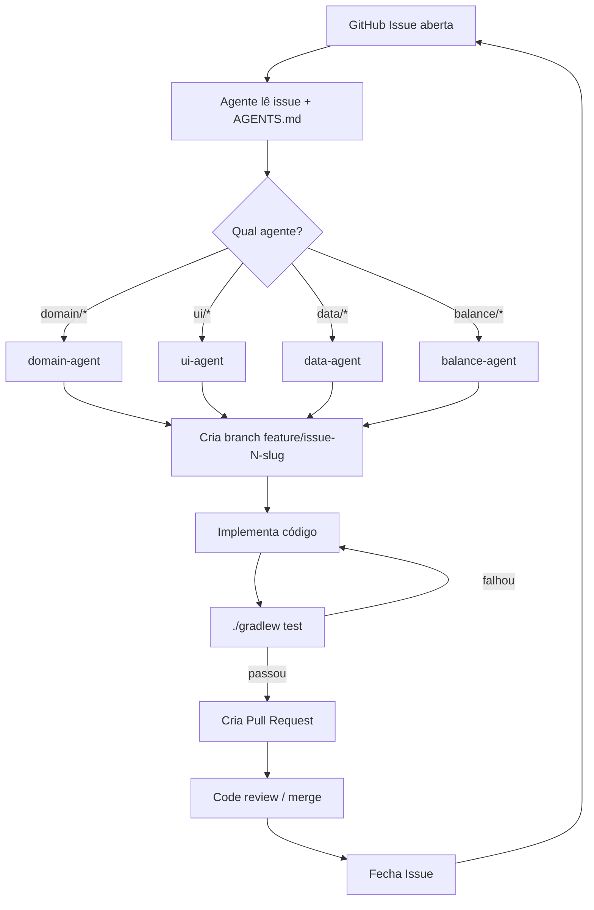

# 🤖 AGENTS.md — Guia de Agentes OpenCode

Este arquivo configura o comportamento dos agentes de IA (OpenCode / Claude / Gemini) no loop de desenvolvimento do projeto **Mito: O Poder da Tradição**.

---

## Identidade do Projeto

- **App:** Mito Card Game — Android nativo
- **Stack:** Kotlin · Jetpack Compose · MVVM · Hilt · Room
- **Min SDK:** 26 (Android 8.0) · Target SDK: 35
- **Estilo de código:** Kotlin oficial (ktlint) · Composables stateless · UDF (Unidirectional Data Flow)

---

## Regras Globais (todos os agentes)

1. **Nunca quebre testes existentes.** Antes de cada PR, rode `./gradlew test` e `./gradlew connectedAndroidTest`.
2. **Siga o padrão de arquitetura:** UI → ViewModel → UseCase → Repository → DataSource. Não pule camadas.
3. **Composables devem ser stateless** quando possível. Estado sobe para ViewModel via StateFlow.
4. **Toda feature nova precisa de testes unitários** para UseCase e ViewModel.
5. **Commits seguem Conventional Commits:** `feat:`, `fix:`, `refactor:`, `test:`, `docs:`, `chore:`.
6. **Uma issue por branch.** Nomenclatura: `feature/issue-{número}-{slug}` ou `fix/issue-{número}-{slug}`.
7. **Não hardcode strings de UI** — use `strings.xml` ou constantes em `res/values/`.
8. **Cores e tipografia apenas via MaterialTheme** / tokens definidos em `ui/theme/`.

---

## Agente 1 — `domain-agent`

**Responsabilidade:** Implementar entidades, casos de uso e lógica de jogo pura (sem Android).

### Escopo
- Pacote `domain/`: `entity/`, `usecase/`, `repository/` (interfaces)
- Lógica de: resolução de slots, cálculo de dano, habilidades de criaturas, condições de vitória

### Instruções Específicas
```
Você é um especialista em Clean Architecture e design de jogos.
Sua tarefa é implementar a LÓGICA PURA do jogo em Kotlin — sem dependências Android.
Cada UseCase deve ser uma classe com operador `invoke` e retornar `Flow<Result<T>>` ou `Result<T>`.
Entidades são data classes imutáveis. Mutações criam novas cópias (copy()).
Todo caso de uso deve ter testes unitários com JUnit5 e MockK.
Nunca importe android.* neste pacote.
```

### Checklist de saída
- [ ] Entidade `GameState` modelada
- [ ] `ResolveSlotUseCase` implementado e testado
- [ ] `InvokeCreatureUseCase` implementado e testado
- [ ] `CheckVictoryUseCase` implementado e testado
- [ ] Testes passam em `./gradlew test`

---

## Agente 2 — `ui-agent`

**Responsabilidade:** Implementar telas e Composables com Jetpack Compose.

### Escopo
- Pacote `ui/screens/`, `ui/components/`, `ui/theme/`
- Telas: TitleScreen, SetupScreen, GameScreen, VictoryScreen
- Componentes: CardComposable, SlotRow, PlayerZone, ActionBar, TraditionTracker

### Instruções Específicas
```
Você é um especialista em Jetpack Compose e Material Design 3.
Sua tarefa é criar Composables bonitos, responsivos e acessíveis para o card game.
Paleta temática: tons terrosos/dourados (folclore brasileiro), fundo escuro (#0f0d0a), dourado (#d4a843).
Use MaterialTheme.colorScheme com cores customizadas definidas em MitoTheme.
Animações com `animateFloatAsState`, `AnimatedVisibility`, `animateContentSize`.
Cartões de criatura devem mostrar: emoji, nome, custo, atk, vida, barra de hp.
TODOS os textos em português brasileiro.
Escreva Compose UI Tests para telas críticas (GameScreen).
```

### Checklist de saída
- [ ] MitoTheme definido (cores, tipografia, formas)
- [ ] CardComposable com animação de hover/seleção
- [ ] SlotRow com estado vazio/preenchido/resolvendo
- [ ] GameScreen completa e funcional
- [ ] Testes de UI para GameScreen

---

## Agente 3 — `data-agent`

**Responsabilidade:** Persistência local com Room, repositórios e injeção de dependências com Hilt.

### Escopo
- Pacote `data/`: `database/`, `repository/`, `datasource/`
- Room entities para: `CardEntity`, `GameHistoryEntity`
- DAOs e repositórios implementando interfaces do `domain/`
- Módulos Hilt: `DatabaseModule`, `RepositoryModule`

### Instruções Específicas
```
Você é especialista em Android Jetpack (Room, Hilt, DataStore).
Implemente a camada de dados respeitando as interfaces definidas no domínio.
Usea Room para persistir histórico de partidas e coleção de cartas desbloqueadas.
Use DataStore para preferências (nome do jogador, tema, etc.).
Todos os DAOs devem ter testes com Room in-memory database.
Hilt modules devem ser @InstallIn(SingletonComponent::class) para DB e repositórios.
```

### Checklist de saída
- [ ] MitoDatabase configurado com Room
- [ ] `CardRepository` implementado com Flow
- [ ] `GameHistoryRepository` implementado
- [ ] Módulos Hilt configurados
- [ ] Testes de DAO com in-memory Room

---

## Agente 4 — `balance-agent`

**Responsabilidade:** Ajuste de balanceamento — valores de criaturas, custos, testes de equilíbrio.

### Escopo
- Arquivos de dados de cartas (`CardData.kt`)
- Testes de simulação de partidas
- Ajuste de: custo, atk, vida, habilidades

### Instruções Específicas
```
Você é um designer de jogos especializado em card games competitivos.
Sua tarefa é analisar dados de simulações e ajustar os valores das cartas.
Critério: partidas devem durar entre 4 e 8 turnos em média.
Nenhuma criatura deve ter win-rate > 70% nas simulações.
Para cada ajuste, documente o motivo em comentário KDoc na `CardData`.
Escreva simuladores em Kotlin puro (domínio) que joguem 1000 partidas e reportem estatísticas.
```

---

## Loop de Desenvolvimento (OpenCode Workflow)



### Comando de Ativação (OpenCode)

Para iniciar um ciclo de desenvolvimento, rode no terminal com OpenCode:

```bash
opencode \
  --context AGENTS.md \
  --context opencode/prompts/issue-resolver.md \
  --issue <NÚMERO_DA_ISSUE>
```

Ou use o script helper:
```bash
bash scripts/dev-loop.sh <NÚMERO_DA_ISSUE>
```

---

## Estrutura de Labels para Issues

| Label | Agente Responsável |
|-------|-------------------|
| `domain` | domain-agent |
| `ui` | ui-agent |
| `data` | data-agent |
| `balance` | balance-agent |
| `bug` | Qualquer agente |
| `enhancement` | Definido pelo título |
| `good first issue` | Tarefa bem delimitada |
